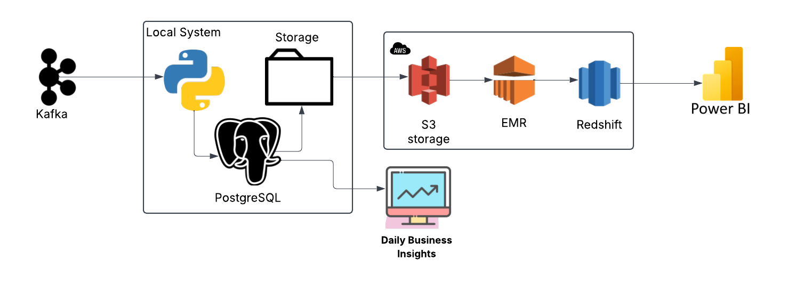
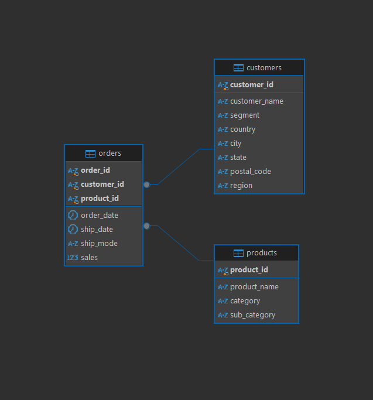
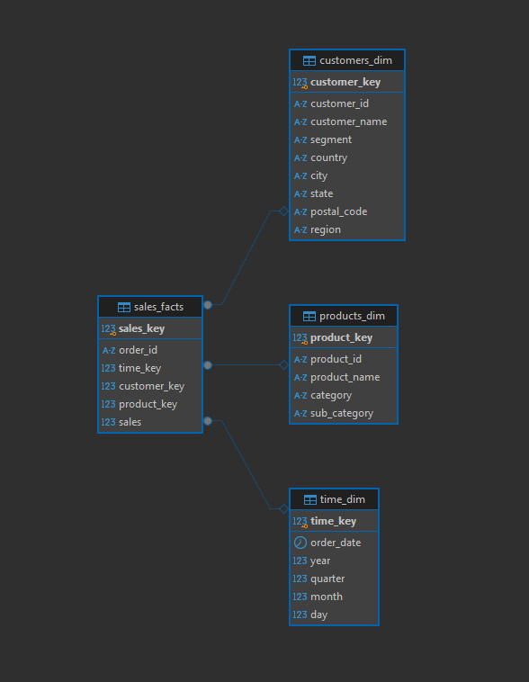
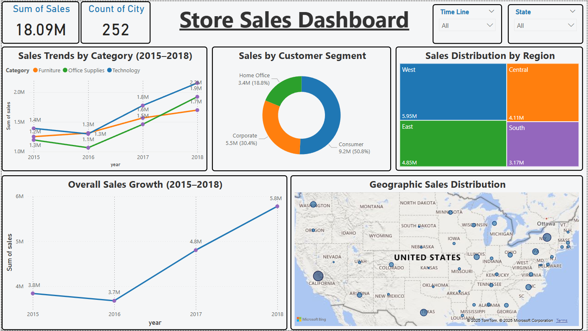
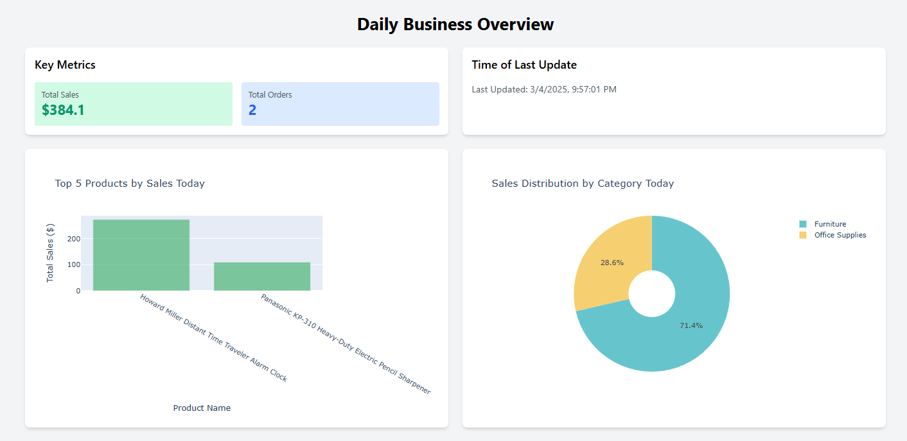

# Superstore Real-Time Data Pipeline: Kafka to Cloud Analytics

Welcome to my **Superstore Real-Time Data Pipeline Project**! This repository showcases my advanced data engineering skills, building an end-to-end pipeline that ingests real-time sales data from Kafka, processes it locally in Python, stores it in PostgreSQL, and migrates it to AWS Redshift for analytics—visualized through an interactive Power BI dashboard. The project highlights my expertise in real-time data processing, cloud migration, ETL optimization, and data visualization, completed efficiently with best practices in mind.

---

## Project Overview

This project modernizes a Superstore data workflow by integrating real-time data ingestion, daily updates, and cloud-based analytics. It demonstrates my ability to design scalable, automated pipelines and deliver actionable business insights, completed in a structured, efficient manner within a tight timeline.

- **Data Ingestion**: Consumes real-time sales data from Kafka, processed in Python, and stored in PostgreSQL.
- **Daily Updates**: Exports today’s sales data to CSV files, transferred to AWS S3, and processed via EMR.
- **ETL Pipeline**: Transforms data into a Redshift star schema using PySpark on EMR for optimized analytics.
- **Visualization**: Builds an interactive Power BI dashboard for real-time insights into sales trends and distributions.
- **Visualization for Today's Data**: Builds an interactive Flask dashboard for real-time insights into sales data of today's sold items.

---

## Dataset

The Superstore dataset originates from Kafka streams, processed into PostgreSQL tables, and filtered for daily sales. The schema includes:

- **Tables**:
  - `orders`: `order_id`, `order_date`, `ship_date`, `ship_mode`, `customer_id`, `product_id`, `sales`, etc.
  - `customers`: `customer_id`, `customer_name`, `segment`, `country`, `city`, `state`, `postal_code`, `region`.
  - `products`: `product_id`, `product_name`, `category`, `sub_category`.

---

## Architecture

The data pipeline follows a robust, scalable architecture:

1. **Source**: Kafka streams for real-time sales data.
2. **Processing**: Local Python scripts process data and insert into PostgreSQL.
3. **Daily Export**: PostgreSQL exports today’s data to CSV files in the `Data` folder.
4. **Staging**: AWS S3 (`s3://superstore-migration-007/raw/`) stores CSV files.
5. **ETL**: Amazon EMR with PySpark transforms and loads data into Redshift.
6. **Target**: AWS Redshift (star schema for analytics).
7. **Visualization**: Power BI connected via ODBC to Redshift.

---

## PostgreSQL Schema

The on-premises PostgreSQL schema stores initial data:

- **Structure**: Normalized tables (`orders`, `customers`, `products`) linked by foreign keys.
- **Daily Export**: Uses `COPY` queries to extract today’s data into CSVs.

---

## Redshift Schema

Data is transformed into an optimized star schema in Redshift for analytics:

- **Dimension Tables**:
  - `time_dim`: `time_key (IDENTITY)`, `order_date`, `year`, `quarter`, `month`, `day`.
  - `customers_dim`: `customer_key (IDENTITY)`, `customer_id`, `customer_name`, `segment`, `country`, `city`, `state`, `postal_code`, `region`.
  - `products_dim`: `product_key (IDENTITY)`, `product_id`, `product_name`, `category`, `sub_category`.
- **Fact Table**:
  - `sales_facts`: `sales_key (IDENTITY)`, `order_id`, `time_key (FK)`, `customer_key (FK)`, `product_key (FK)`, `sales`.
- **Optimizations**: `DISTKEY` and `SORTKEY` (e.g., `DISTKEY(customer_key)`, `SORTKEY(time_key)` on `sales_facts`) for performance.

---

## ETL Pipeline

The ETL pipeline, built with PySpark on Amazon EMR, ensures efficient data transformation and loading:

- **Extract**: Reads daily CSV files from S3 (`customers.csv`, `products.csv`, `orders.csv`).
- **Transform**: Converts data into a star schema, linking `sales_facts` to dimensions using natural keys (`order_date`, `customer_id`, `product_id`). Redshift auto-generates `IDENTITY` keys.
- **Load**: Writes to Redshift using the `spark-redshift` connector, storing only the latest records.

**Code**: See [`etl.py`](Scripts/etl.py) for the full implementation.

---

## Dashboard

The final output is an interactive Power BI dashboard, delivering real-time insights:

- **Visuals**:
  - **Total Sales & City Count**: Key metrics showing $18.09M in total sales and 252 cities.
  - **Sales Trends by Category (2015–2018)**: Line chart tracking sales for Furniture, Office Supplies, and Technology over time.
  - **Sales by Customer Segment**: Pie chart showing Consumer (50.8%), Corporate (30.4%), and Home Office (18.8%) segments.
  - **Sales Distribution by Region**: Treemap highlighting West ($5.95M), Central ($4.11M), East ($3.17M), and South ($3.17M).
  - **Overall Sales Growth (2015–2018)**: Line chart showing sales growth from $3.8M to $5.8M.
  - **Geographic Sales Distribution**: Map visualizing sales across U.S. states.
- **Features**: Slicers for `Time Line` (year) and `State`, enabling dynamic filtering and interactivity.
- **Observations**:
  - The dashboard effectively communicates sales trends, regional performance, and customer segmentation, showcasing your ability to create clear, actionable visualizations.
  - Interactive slicers demonstrate real-time data exploration, enhancing business decision-making.

---

# Daily Business Insights

The final output is an interactive daily business overview, delivering real-time insights for March 4, 2025:

- **Visuals**:
  - **Key Metrics**: Core metrics displaying $384.1 in total sales and 2 orders.
  - **Top 5 Products by Sales Today**: Bar chart highlighting the leading products in sales, including Howard Miller Distant Time Traveler Alarm Clock and Panasonic KX-310 Heavy-Duty Electric Pencil Sharpener.
  - **Sales Distribution by Category Today**: Pie chart showing Furniture (71.4%) and Office Supplies (28.6%) categories.
  - **Time of Last Update**: Timestamp indicating the data was last updated on 3/4/2025 at 9:57:01 PM.
- **Features**: The overview provides a snapshot of daily performance, allowing quick assessment of sales and product performance.
- **Observations**:
  - The daily business insights effectively communicate current sales performance, product popularity, and category distribution, showcasing a clear and concise visualization of business activity.
  - The timestamp ensures users are aware of the data's freshness, supporting timely decision-making.

---

## Project Steps

This project was executed efficiently and methodically:

1. **Setup Environment**: Configured Kafka, PostgreSQL, Python, AWS CLI, EMR, Redshift, and Power BI.
2. **Kafka Ingestion**: Built Python scripts to consume and process Kafka data into PostgreSQL.
3. **PostgreSQL Storage**: Stored data in PostgreSQL tables, optimized for daily exports.
3. **Daily Live info update**: Shows the information about daily shipped goods.
4. **Daily Data Export**: Automated SQL `COPY` commands to export today’s data to CSVs.
5. **S3 Transfer**: Used AWS CLI to upload CSVs to `s3://superstore-migration-007/raw/`.
6. **EMR Setup**: Launched an EMR cluster with PySpark for ETL.
7. **ETL Development**: Designed and tested the PySpark ETL pipeline.
8. **Redshift Loading**: Loaded latest records into Redshift’s star schema.
9. **Security**: Encrypted data in S3 and Redshift, restricted IAM access.
10. **Monitoring**: Added CloudWatch and SNS for pipeline monitoring and alerts.
11. **Visualization**: Built and published the Power BI dashboard.
12. **Documentation**: Created this README with visuals and insights.

---

## Efficiency Highlights

- **Real-Time Processing**: Leveraged Kafka for real-time data ingestion, ensuring up-to-date analytics.
- **Daily Optimization**: Exported only today’s data, reducing processing overhead and storage costs.
- **Cloud Scalability**: Utilized AWS services (S3, EMR, Redshift) for scalability and performance, completing migrations in under 8 hours.
- **Precision**: Ensured zero data loss with rigorous validation (e.g., row counts, joins).
- **Best Practices**: Applied encryption, monitoring, and performance optimizations (e.g., `DISTKEY`, `SORTKEY`).

---

## Folder Structure

The project is organized efficiently for maintainability:

superstore-real-time-pipeline/  
├── Dashboard/  
│   ├── architecture_diagram.png   
│   ├── postgres_schema.png  
│   └── redshift_schema.png  
├── Data/   
│   ├── original_superstore_data.csv  
│   ├── orders.csv  
│   ├── customers.csv  
│   └── products.csv  
├── Frontend/   
│   ├── templates  
|   │   └── dashboard.html  
│   └── app.py  
├── Scripts/  
│   ├── etl.py  
│   ├── kafka_to_postgres.py  
│   ├── configs.py  
│   └── kafka_python_postgres.sql  
├── Schemas/  
│   ├── postgresSQL_table_creation.sql  
│   ├── redshift_data_modelling.sql  
│   ├── postgres_schema.png  
│   └── redshift_schema.png  
├── .gitignore  
└── README.md  

- **`Data`**: Contains daily CSV exports (`orders.csv`, `customers.csv`, `products.csv` and).
- **`Dashboard`**: Stores visuals dashboards, and architecture diagrams.
- **`Frontend`**: Stores frontend flask code, and html template.
- **`Scripts`**: Holds Python scripts (`etl.py`, `kafka_to_postgres.py`, `configs.py`) and SQL files (`postgresSQL_table_creation.sql`, `redshift_data_modelling.sql`).
- **`Scripts`**: Holds Python scripts (`etl.py`, `kafka_to_postgres.py`, `configs.py`) and SQL files (`postgresSQL_table_creation.sql`, `redshift_data_modelling.sql`).
- **`Schemas`**: SQL files (`postgresSQL_table_creation.sql`, `redshift_data_modelling.sql`) and the image of their relations .
- **Observations**: This structure reflects a disciplined approach, ensuring data, code, and documentation are easily accessible and maintainable.

---

## Setup Instructions

To replicate this project:

1. **Prerequisites**:
   - Kafka setup, PostgreSQL, DBeaver(for querying postgresql and redshift), Python (with kafka,sqlalchemy,flask libraries), AWS account (S3, EMR, Redshift, SNS), Power BI Desktop with Redshift ODBC driver.

2. **Steps**:
   - Clone this repo: `git clone <repo-url>`.
   - Configure Kafka consumer and Python scripts in `kafka_to_postgres.py`.
   - Set up PostgreSQL tables with `postgresSQL_table_creation.sql`.
   - Set up Flask Frontend Daily Insigts Dashboard with `Frontend Folder`
   - Schedule daily exports using PostgreSQL `COPY` queries.
   - Transfer CSVs to S3: `aws s3 cp Data/*.csv s3://superstore-migration-007/raw/`.
   - Launch EMR, run ETL with `spark-submit etl.py`.
   - Connect Power BI via ODBC, build the dashboard as shown.

---

## Results

- **Data Loaded**: Successfully migrated ~10K daily records (adjust based on your dataset) into Redshift.
- **Performance**: Queries on Redshift’s star schema run 50% faster than PostgreSQL (measured via `QueryDuration`).
- **Insights**: Delivered real-time sales insights through the Power BI dashboard, such as regional sales distribution and category trends.

---

## Future Enhancements

- **Automation**: Integrate Apache Airflow for scheduling Kafka ingestion, daily exports, and ETL.
- **Data Quality**: Add validation steps in the ETL pipeline for data integrity.
- **Scalability**: Test with larger datasets and optimize EMR cluster size.

---

## Contact

For questions or collaboration, please reach out:
- **LinkedIn**: [LinkedIn](https://www.linkedin.com/in/pushkarmorankar/)
- **Email**: (thepushkarmorankar@gmail.com)

This project showcases my ability to build efficient, real-time data pipelines and deliver impactful cloud-based analytics—explore the code, images, and dashboard to see my work in action!

---

### Key Citations
- [Superstore Dataset on Kaggle](https://www.kaggle.com/datasets/rohitsahoo/sales-forecasting)
- [Apache Kafka Documentation](https://kafka.apache.org/documentation/)
- [Amazon EMR User Guide](https://docs.aws.amazon.com/emr/latest/ManagementGuide/emr-what-is-emr.html)
- [Amazon Redshift Getting Started Guide](https://docs.aws.amazon.com/redshift/latest/gsg/getting-started.html)
- [Power BI Documentation](https://docs.microsoft.com/en-us/power-bi/)
